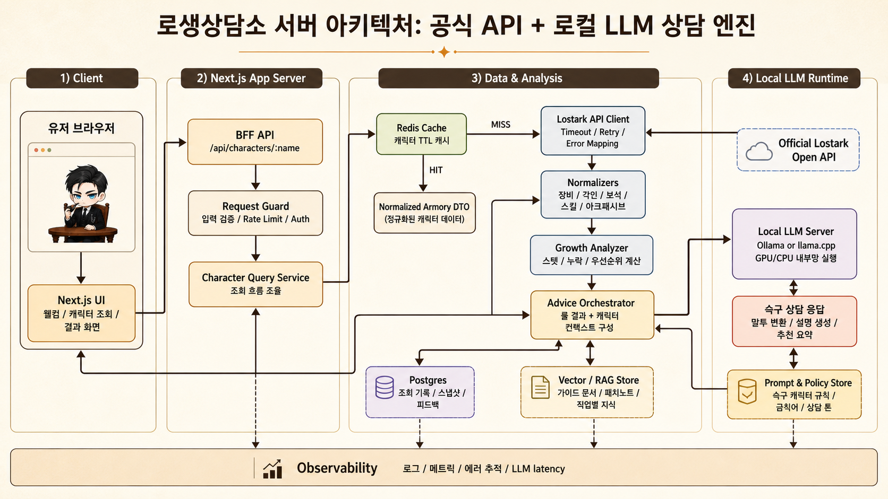

# 로생상담소

Lost Ark 캐릭터 정보를 조회하고 장비, 아크 패시브, 스킬, 보석, 아바타, 악세/각인 효율을 분석하기 위한 Next.js 프로젝트다. 최종 목표는 공식 API 기반 캐릭터 분석과 로컬 LLM 상담 엔진을 결합해, 슥구가 따뜻한 상담소 톤으로 성장 고민을 정리해주는 경험이다.

## 아키텍처



현재는 Next.js가 화면 렌더링을 담당하고, Spring Boot가 브라우저-facing API, 공식 Lostark API 연동, 시장 데이터, 전투력/스펙업 계산, 슥구 상담 BFF를 담당한다. 앞으로는 Spring Boot 안에서 캐시, 저장소, 분석 엔진, 로컬 LLM 런타임을 분리한 모듈러 모놀리스 구조로 확장한다.

- **BFF API:** 브라우저 요청을 받아 입력 검증, 오류 변환, 응답 DTO 조립을 담당한다.
- **Lostark API Client:** 공식 API 호출, 타임아웃, 재시도, 에러 매핑을 전담한다.
- **Data & Analysis:** 장비, 각인, 보석, 스킬, 아크 패시브를 정규화하고 성장 우선순위를 계산한다.
- **Local LLM Runtime:** Ollama 또는 llama.cpp 기반 로컬 모델로 슥구 말투의 상담 응답을 생성한다.
- **Cache & Storage:** Redis 캐시와 Postgres 조회 기록을 통해 속도, 비용, 상담 품질을 관리한다.

## 문서

- [개발 일지](./docs/development-log.md)
- [로스트아크 데미지 계산 기준](./docs/lostark-damage-formula.md)
- [다음 작업 메모](./NEXT_TASKS.md)

## 개발 명령

```bash
cd backend
./mvnw spring-boot:run

cd ..
npm run dev

npm run dev
npm run dev:restart
npm run smoke:sggu
npm test
npm run lint
npm run build
```

## 로컬 LLM smoke test

`npm run smoke:sggu`는 실행 중인 Next.js 서버의 `POST /api/consult/sggu`를 호출해 Spring Boot 상담 API와 Ollama 연결을 함께 확인한다.

```bash
ollama serve
ollama pull qwen2.5:7b
cd backend
./mvnw spring-boot:run

cd ..
npm run dev
npm run smoke:sggu
```

Next.js 서버가 다른 포트라면 `SGGU_CONSULT_BASE_URL`을 바꾼다.

```bash
SGGU_CONSULT_BASE_URL=http://127.0.0.1:3001 npm run smoke:sggu
```

WSL에서 Windows Ollama 서버를 쓰는 경우 `.env.local`의 `LOCAL_LLM_BASE_URL`을 Windows host 주소로 맞춘 뒤 Next.js 서버를 재시작한다.

## Spring Boot backend

The Java backend lives in `backend/` and runs on `http://127.0.0.1:8080`.

Migrated browser API paths:

- `GET /api/characters/{name}`
- `GET /api/market/snapshot`
- `POST /api/consult/sggu`
- `GET /api/efficiency/spec-up/{name}`
- `POST /api/efficiency/accessories/recovery`

```bash
cd backend
./mvnw test
./mvnw spring-boot:run
```

Next.js renders UI and proxies migrated paths to Spring Boot by default in local development. Set `SPRING_API_PATHS` only when overriding the default proxy list:

```bash
npm run dev
```

It reads `LOSTARK_API_KEY` first and falls back to `LOSTARK_OPEN_API_KEY`.

## 환경 변수

Next.js 개발 서버는 `.env.example`을 참고해 루트 `.env.local`을 만든다. `.env.local`은 Git에 올리지 않는다.

Spring Boot backend는 `.env.local`을 자동으로 읽지 않으므로 실행 셸에 환경 변수를 설정한다.

```bash
export LOSTARK_API_KEY=your_lostark_open_api_jwt
cd backend
./mvnw spring-boot:run
```

`LOSTARK_OPEN_API_KEY`도 fallback으로 사용할 수 있다.
