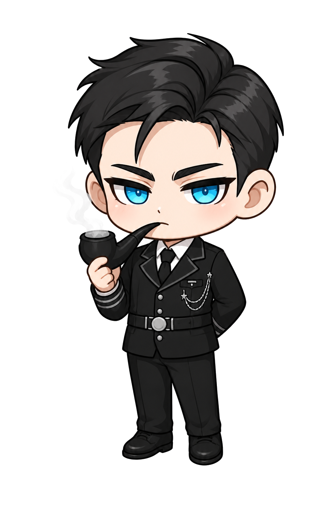

# Sggu Character Guide

이 문서는 슥구 이미지와 애니메이션을 만들 때 사용하는 캐릭터 기준이다.
슥구가 다른 캐릭터처럼 바뀌는 것을 막기 위해, 새 이미지 생성보다 기존 기준 에셋의 변형과 애니메이션을 우선한다.
이미지 생성용 세부 프롬프트와 상황별 예시는 [Sggu Prompt Rules](./sggu-prompt-rules.md)를 따른다.

## Canonical Asset

기준 에셋은 `public/sggu-cutout.png`다.

새 슥구 이미지, 컷아웃, 애니메이션, 상담 장면을 만들 때는 이 에셋을 가장 먼저 확인한다. `public/sggu-welcome-canonical.png`와 다른 파생 에셋은 보조 참고 자료로만 사용한다.

## Core Identity

- 머리는 짧은 검은색이며, 위로 크게 솟고 뒤로 쓸린 각진 실루엣을 유지한다.
- 중앙에는 길게 내려오는 굵은 앞머리 한 가닥이 있고, 좌우에는 뾰족하게 뻗는 옆머리가 있다.
- 머리 하이라이트는 둥글고 부드러운 결보다 날카로운 덩어리감과 각진 면을 우선한다.
- 눈은 선명한 시안 블루 계열이다. 둥근 홍채, 또렷한 하이라이트, 강한 위쪽 눈매를 유지한다.
- 눈썹은 굵고 직선적인 검은 눈썹이다. 순하거나 처진 인상으로 바꾸지 않는다.
- 표정은 귀엽지만 진지한 무표정에 가깝다. 과하게 웃거나 겁먹은 표정은 기본 슥구에 맞지 않는다.
- 얼굴 비율은 큰 머리, 작은 몸, 또렷한 눈이 보이는 chibi 스타일을 유지한다.

## Outfit And Props

- 기본 복장은 검은 정장, 흰 셔츠, 검은 넥타이다.
- 은색 단추, 벨트 버클, 체인 장식처럼 절제된 금속 포인트를 사용할 수 있다.
- 기본 소품은 파이프다. 연기는 부드러운 회색 계열로 약하게 표현한다.
- 장면상 필요한 경우 소품이나 자세는 바꿀 수 있지만, 얼굴 정체성과 검은 정장 기반의 상담사 인상은 유지한다.

## Animation Rules

- 가능하면 `public/sggu-cutout.png`를 직접 사용해 CSS, canvas, sprite mask, transform 기반 애니메이션을 만든다.
- 안전한 기본 애니메이션은 눈 깜빡임, 미세한 고개 끄덕임, 말풍선 타이핑 반응, 2-4px 정도의 부드러운 idle motion이다.
- 캐릭터 전체를 새로 그리는 애니메이션보다, 기존 컷아웃을 유지한 상태에서 레이어나 오버레이를 추가하는 방식을 우선한다.
- 새 프레임을 생성해야 한다면 첫 프레임은 반드시 `public/sggu-cutout.png`와 얼굴, 머리, 눈, 눈썹이 같은 사람으로 보여야 한다.

## Do Not

- 텍스트 프롬프트만으로 슥구를 새로 생성하지 않는다.
- 머리를 웨이브, 장발, 푹신한 곱슬머리, 둥근 실루엣으로 바꾸지 않는다.
- 눈을 보라색, 흐릿한 파란색, 회색, 처진 눈매로 바꾸지 않는다.
- 눈썹을 얇게 만들거나 부드러운 인상으로 바꾸지 않는다.
- 밝은 판타지 의상, 교복, 후드티처럼 기본 상담사 정체성을 흐리는 복장으로 바꾸지 않는다.
- 과한 밈 표정이나 장난스러운 과장 표정을 기본 슥구로 사용하지 않는다.

## Review Checklist

새 슥구 에셋이나 애니메이션을 반영하기 전 아래 질문에 모두 답한다.

- `public/sggu-cutout.png`와 같은 캐릭터로 보이는가?
- 검은 각진 머리, 중앙 앞머리, 시안 블루 눈, 굵은 검은 눈썹이 유지되는가?
- 표정이 귀엽지만 진지한 상담사 인상을 유지하는가?
- 새 포즈나 소품이 캐릭터 정체성을 흐리지 않는가?
- 기존 컷아웃 애니메이션으로 해결할 수 있는데 불필요하게 새 이미지를 생성하지 않았는가?
